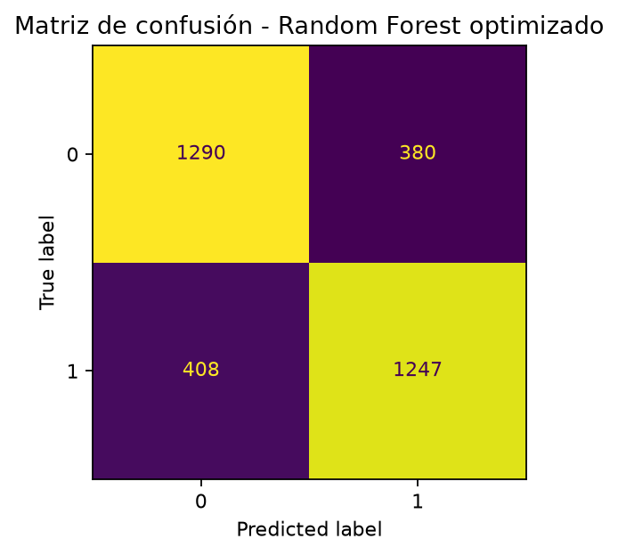
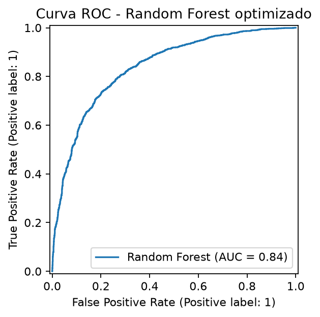
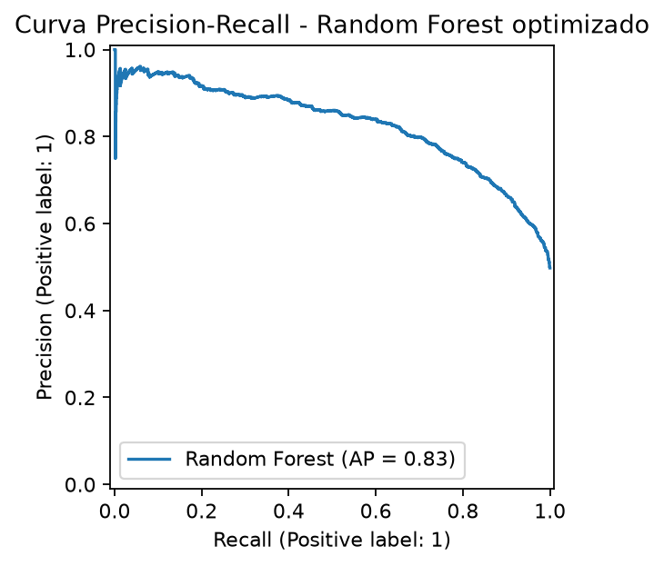
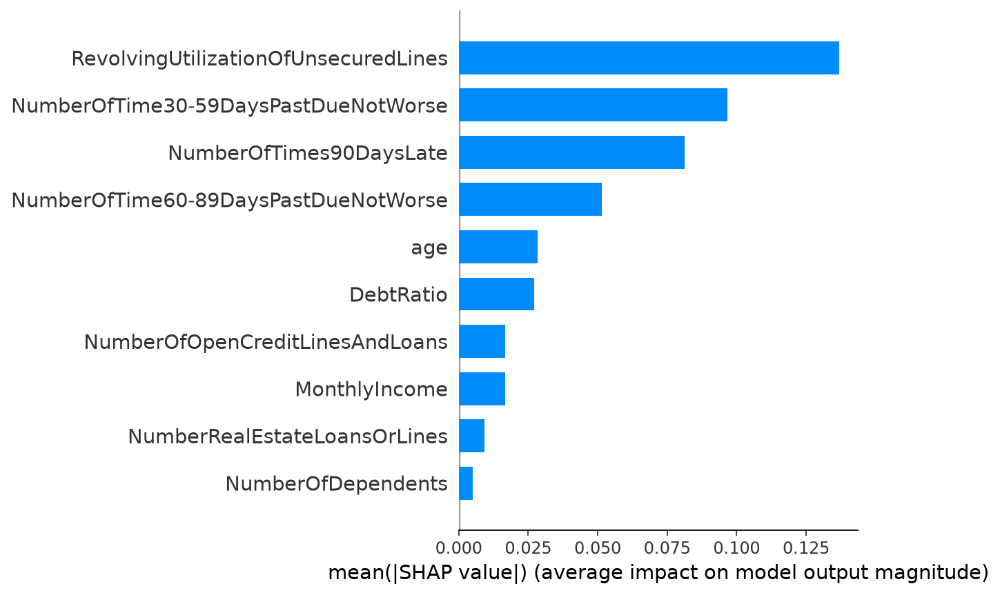
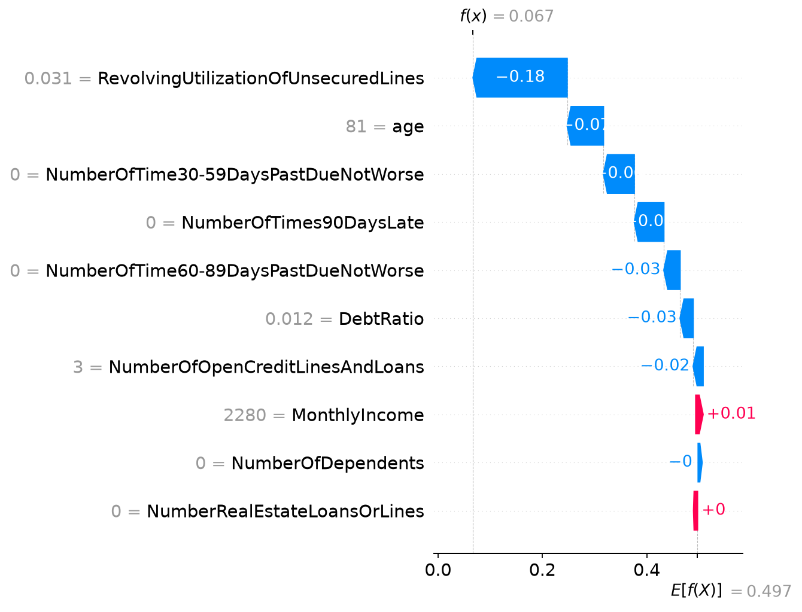
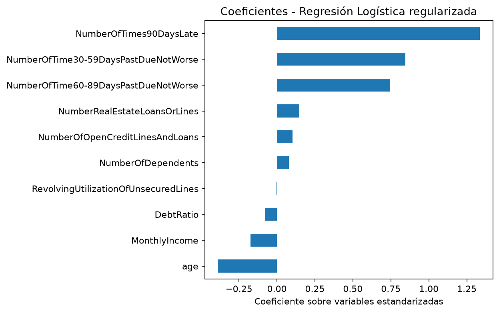
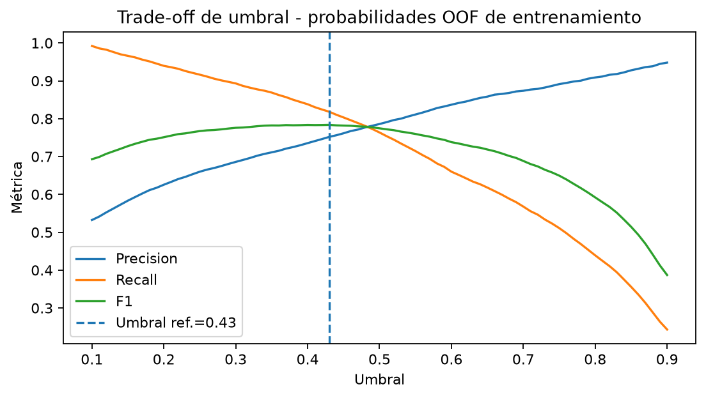

# Interpretabilidad de Scoring Crediticio

Proyecto de **Machine Learning explicable** para estimar riesgo de morosidad a dos años. Compara **Regresión Logística regularizada** y **Random Forest**, con validación cruzada sin leakage, análisis de umbral e interpretabilidad global/local mediante **SHAP y LIME**.

[](https://github.com/Koke-Oliva/Interpretabilidad-de-Scoring-Crediticio/actions/workflows/notebook-ci.yml)
[](https://www.python.org/)
[](https://scikit-learn.org/)
[](https://shap.readthedocs.io/)
[](https://colab.research.google.com/github/Koke-Oliva/Interpretabilidad-de-Scoring-Crediticio/blob/main/Interpretabilidad_de_Scoring_Crediticio.ipynb)
[](https://nbviewer.org/github/Koke-Oliva/Interpretabilidad-de-Scoring-Crediticio/blob/main/Interpretabilidad_de_Scoring_Crediticio.ipynb)

## Vista rápida

- **Mejor discriminación:** Random Forest optimizado, **ROC-AUC 0.8394** y **PR-AUC 0.8287**.
- **Trade-off de decisión:** un umbral de referencia de **0.43**, definido con predicciones out-of-fold de entrenamiento, aumenta el recall a **0.8115**.
- **Explicabilidad:** coeficientes estandarizados + **SHAP global/local** + **LIME** sobre el mismo caso.
- **Rigor metodológico:** test aislado, `Pipeline`, `StratifiedKFold`, tuning y análisis de umbral sin optimizar sobre test.
- **Reproducibilidad:** GitHub Actions ejecuta el notebook de principio a fin y regenera las figuras.

> Proyecto demostrativo de portafolio. No está planteado como sistema de decisión crediticia para producción.

## Problema

El objetivo es predecir `SeriousDlqin2yrs`:

- **0:** sin evento grave de morosidad en los próximos dos años.
- **1:** con evento grave de morosidad en los próximos dos años.

**Dataset:** `Credit` (v1), OpenML.  
**Tipo:** clasificación binaria.  
**Muestra utilizada después de limpieza:** 16.625 registros y 10 predictores.

## Metodología

1. EDA y controles de calidad.
2. Eliminación documentada de códigos anómalos `96/98` en variables de mora.
3. Split **80/20 estratificado**, `random_state=42`.
4. Random Forest sobre variables en escala original.
5. Regresión Logística con `StandardScaler` dentro de un `Pipeline`.
6. Tuning con `GridSearchCV` y `StratifiedKFold(5)`.
7. Evaluación final en test con Accuracy, Precision, Recall, F1, ROC-AUC y PR-AUC.
8. Matriz de confusión, ROC y Precision–Recall.
9. Ajuste exploratorio de umbral con probabilidades **out-of-fold** de entrenamiento.
10. Interpretabilidad con coeficientes estandarizados, **SHAP global/local** y **LIME local**.
11. Diagnóstico de Recall/FPR por grupos de edad.

### Prevención de leakage

El test permanece aislado hasta la evaluación final. En la Regresión Logística, el escalado se ejecuta dentro del pipeline y se reajusta en cada fold de validación cruzada. El ajuste exploratorio de umbral se realiza con predicciones out-of-fold sobre entrenamiento, no optimizando sobre test.

## Resultados finales

| Modelo | Threshold | Accuracy | Precision | Recall | F1 | ROC-AUC | PR-AUC |
|---|---:|---:|---:|---:|---:|---:|---:|
| **Random Forest optimizado** | 0.50 | **0.7630** | 0.7664 | 0.7535 | 0.7599 | **0.8394** | **0.8287** |
| Regresión Logística optimizada | 0.50 | 0.7245 | **0.8031** | 0.5915 | 0.6813 | 0.7950 | 0.8094 |
| Random Forest — umbral OOF | 0.43 | 0.7579 | 0.7315 | **0.8115** | **0.7694** | 0.8394 | 0.8287 |

El Random Forest optimizado presenta la mayor discriminación global. El umbral de referencia `0.43`, elegido exclusivamente con predicciones out-of-fold del entrenamiento, eleva el recall de **0.7535 a 0.8115** y el F1 de **0.7599 a 0.7694**, a costa de una menor precisión.

### Hiperparámetros seleccionados

**Random Forest**

```text
max_depth=10
max_features=sqrt
min_samples_leaf=2
min_samples_split=5
n_estimators=200
```

**Regresión Logística**

```text
C=100
penalty=l2
solver=liblinear
```

## Evaluación visual

### Matriz de confusión



### Curva ROC



### Curva Precision–Recall



## Interpretabilidad

### SHAP global

SHAP identifica como principales drivers del Random Forest:

1. `RevolvingUtilizationOfUnsecuredLines`
2. `NumberOfTime30-59DaysPastDueNotWorse`
3. `NumberOfTimes90DaysLate`
4. `NumberOfTime60-89DaysPastDueNotWorse`
5. `age`



### SHAP local + LIME

El notebook explica el **mismo caso** con SHAP y LIME, permitiendo contrastar qué variables dominan una predicción individual y detectar coincidencias o divergencias entre explicadores.



Las explicaciones representan el comportamiento del modelo y **no implican causalidad**.

### Regresión Logística

Los coeficientes se interpretan después de estandarizar todas las variables dentro del pipeline, haciendo más coherente la comparación de magnitudes bajo regularización.



## Umbral de decisión

El notebook estudia el trade-off Precision–Recall–F1 sin utilizar el test para escoger el umbral.



En un escenario real, el umbral debe elegirse según el costo relativo de:

- **falsos negativos:** clientes riesgosos no detectados;
- **falsos positivos:** clientes solventes clasificados como riesgosos.

## Diagnóstico por edad

El dataset no contiene género, por lo que no es posible evaluar esa dimensión. Se reportan métricas por cuartiles de edad definidos desde entrenamiento. En la ejecución validada, el recall y el FPR varían entre grupos, por lo que estas diferencias deben considerarse una **señal de revisión**, no evidencia suficiente de fairness o discriminación.

## Reproducibilidad

El notebook fue validado de principio a fin mediante **GitHub Actions**. El workflow instala un entorno limpio, ejecuta todas las celdas y regenera las figuras.

```bash
git clone https://github.com/Koke-Oliva/Interpretabilidad-de-Scoring-Crediticio.git
cd Interpretabilidad-de-Scoring-Crediticio

python -m venv .venv

# Linux/macOS
source .venv/bin/activate

# Windows PowerShell
# .venv\Scripts\Activate.ps1

pip install -r requirements.txt
jupyter notebook Interpretabilidad_de_Scoring_Crediticio.ipynb
```

## Estructura

```text
.
├── .github/
│   └── workflows/
│       └── notebook-ci.yml
├── figures/
│   ├── logistic_coefficients.png
│   ├── rf_confusion_matrix.png
│   ├── rf_pr_curve.png
│   ├── rf_roc_curve.png
│   ├── shap_global_bar.png
│   ├── shap_local_waterfall.png
│   └── threshold_tradeoff.png
├── Interpretabilidad_de_Scoring_Crediticio.ipynb
├── requirements.txt
├── .gitignore
├── LICENSE
└── README.md
```

## Limitaciones

- El dataset es una variante preprocesada y prácticamente balanceada; no representa necesariamente una cartera crediticia real.
- La evaluación en un test interno no sustituye validación temporal ni externa.
- SHAP y LIME explican predicciones del modelo, no relaciones causales.
- El diagnóstico por edad es parcial y no constituye una auditoría completa de fairness.
- Un despliegue real requeriría calibración, monitoreo de drift, validación de estabilidad y gobernanza del modelo.

## Contexto

Proyecto desarrollado inicialmente como evaluación de la **Especialización en Machine Learning — IT Academy / Kibernum**. La versión actual conserva el alcance original y refuerza metodología, reproducibilidad, evaluación e interpretabilidad.
