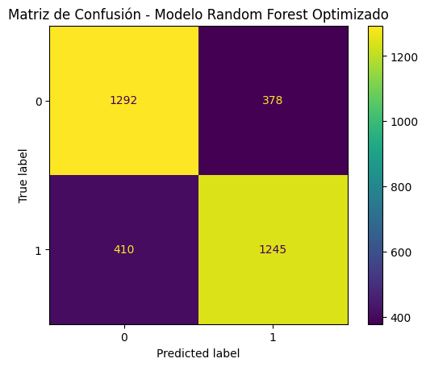
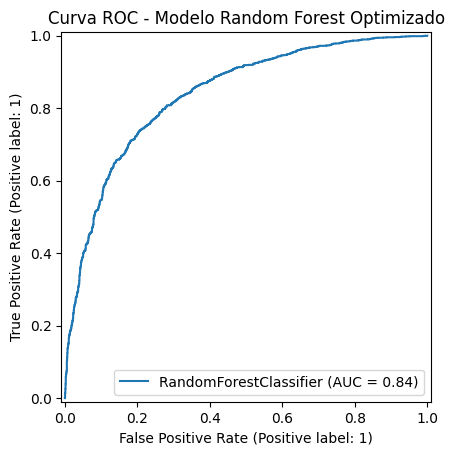
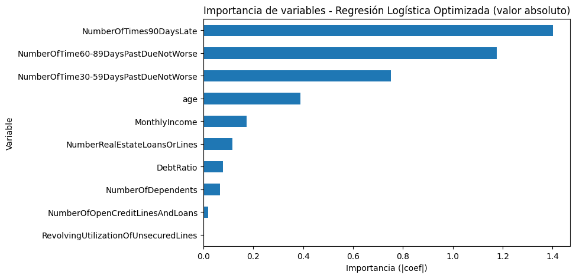

# Interpretabilidad de Scoring Crediticio

Proyecto de **Machine Learning explicable** para estimar riesgo de morosidad a dos años. Compara **Regresión Logística regularizada** y **Random Forest**, incorpora validación cruzada sin leakage y añade explicabilidad global/local con **SHAP y LIME**.

[](https://www.python.org/)
[](https://scikit-learn.org/)
[](https://shap.readthedocs.io/)
[](./Interpretabilidad_de_Scoring_Crediticio.ipynb)
[](https://colab.research.google.com/github/Koke-Oliva/Interpretabilidad-de-Scoring-Crediticio/blob/portfolio-professionalization/Interpretabilidad_de_Scoring_Crediticio.ipynb)
[](https://nbviewer.org/github/Koke-Oliva/Interpretabilidad-de-Scoring-Crediticio/blob/portfolio-professionalization/Interpretabilidad_de_Scoring_Crediticio.ipynb)

## Problema

El objetivo es predecir `SeriousDlqin2yrs`:

- **0:** sin evento grave de morosidad en los próximos dos años.
- **1:** con evento grave de morosidad en los próximos dos años.

**Fuente:** OpenML, dataset `Credit` (v1).  
**Tipo de problema:** clasificación binaria.

## Metodología

1. Revisión de calidad y EDA.
2. Eliminación documentada de códigos anómalos `96/98` en variables de mora.
3. Split **80/20 estratificado** con `random_state=42`.
4. **Random Forest** sobre variables en escala original.
5. **Regresión Logística** con `StandardScaler` dentro de un `Pipeline`.
6. Tuning con `GridSearchCV` + `StratifiedKFold(5)`.
7. Evaluación final en test con Accuracy, Precision, Recall, F1, ROC-AUC y PR-AUC.
8. Matriz de confusión, ROC y Precision–Recall.
9. Ajuste exploratorio de umbral usando probabilidades **out-of-fold** de entrenamiento.
10. Interpretabilidad mediante coeficientes estandarizados, **SHAP global/local** y **LIME local**.
11. Diagnóstico de Recall/FPR por grupos de edad.

### Control de leakage

El conjunto de test queda aislado hasta la evaluación final. El escalado de Regresión Logística está dentro del pipeline, por lo que se ajusta de forma independiente en cada fold de validación cruzada. El umbral se estudia con probabilidades out-of-fold del entrenamiento, no optimizando sobre test.

## Resultados de referencia

La ejecución originalmente evaluada del proyecto produjo:

| Modelo | Accuracy | Precision | Recall | F1 | ROC-AUC |
|---|---:|---:|---:|---:|---:|
| Random Forest optimizado | 0.7630 | 0.7671 | 0.7523 | 0.7596 | 0.8393 |
| Regresión Logística optimizada | 0.7245 | 0.8031 | 0.5915 | 0.6813 | 0.7950 |

> **Importante:** estos valores se conservan como referencia de la ejecución evaluada. El notebook profesionalizado recalcula todas las métricas de principio a fin y es la fuente de verdad para futuras actualizaciones, evitando copiar manualmente resultados potencialmente desactualizados.

### Evidencia visual de la ejecución de referencia

**Matriz de confusión — Random Forest optimizado**



**Curva ROC — Random Forest optimizado**



**Coeficientes — Regresión Logística regularizada**



Estas figuras corresponden a la ejecución original evaluada. Al ejecutar la versión profesionalizada, el notebook genera nuevamente los artefactos ROC, PR, matriz de confusión, umbral y explicabilidad en `figures/`.

## Interpretabilidad

La versión profesionalizada incorpora tres niveles:

- **Regresión Logística:** coeficientes sobre variables estandarizadas.
- **SHAP:** importancia global y explicación local del Random Forest.
- **LIME:** explicación del mismo caso local para contrastar coincidencias y divergencias con SHAP.

Las explicaciones describen el comportamiento del modelo y **no deben interpretarse como relaciones causales**.

## Umbral de decisión

Además del umbral estándar `0.5`, el notebook calcula un umbral de referencia mediante predicciones out-of-fold de entrenamiento. Esto permite visualizar el trade-off entre **Precision, Recall y F1** sin utilizar el conjunto de test para optimizar el umbral.

En un escenario real, esta decisión debe incorporar el costo de:

- falsos negativos: clientes riesgosos no detectados;
- falsos positivos: clientes solventes clasificados como riesgosos.

## Análisis de subgrupos

El dataset no incluye género, por lo que no es posible auditar esa dimensión. Se incluye un diagnóstico por **grupos de edad**, con soporte, tasa positiva, Recall, FPR y Precision. Se presenta como señal exploratoria y no como auditoría completa de fairness.

## Estructura

```text
.
├── Interpretabilidad_de_Scoring_Crediticio.ipynb
├── figures/
│   └── README.md
├── requirements.txt
├── .gitignore
├── LICENSE
└── README.md
```

El notebook exporta las figuras principales a `figures/` al ejecutarse.

## Reproducibilidad

```bash
git clone https://github.com/Koke-Oliva/Interpretabilidad-de-Scoring-Crediticio.git
cd Interpretabilidad-de-Scoring-Crediticio

python -m venv .venv
# Linux/macOS
source .venv/bin/activate
# Windows PowerShell
# .venv\Scripts\Activate.ps1

pip install -r requirements.txt
jupyter notebook Interpretabilidad_de_Scoring_Crediticio.ipynb
```

También puede ejecutarse directamente con el badge **Open in Colab**.

## Limitaciones

- El dataset es una variante preprocesada y balanceada; no representa necesariamente una cartera crediticia real.
- Un test interno no sustituye validación temporal ni externa.
- SHAP/LIME explican predicciones del modelo, no causalidad.
- El análisis por edad es parcial; faltan otras variables sensibles.
- Un despliegue real requeriría calibración, monitoreo de drift, validación de estabilidad y gobernanza del modelo.

## Contexto académico

Proyecto desarrollado como evaluación de la Especialización en Machine Learning de IT Academy / Kibernum. La profesionalización posterior conserva el alcance original y refuerza reproducibilidad, prevención de leakage, evaluación e interpretabilidad.
